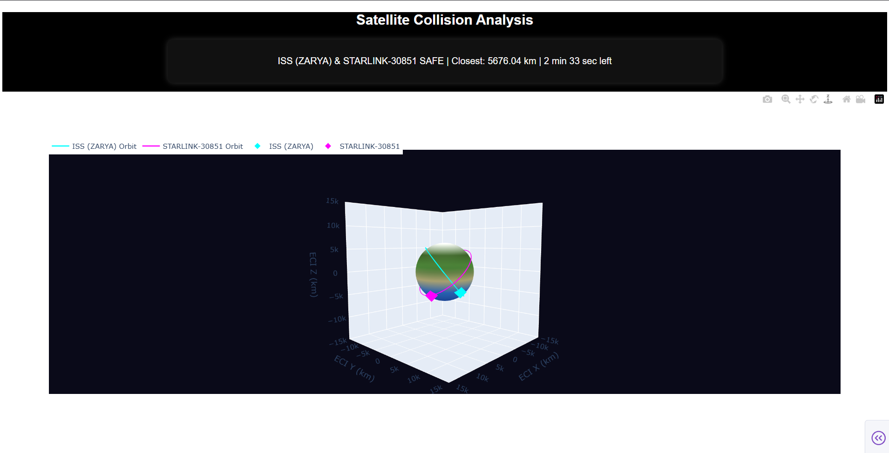

# 🛰️ Satellite Trajectory Analyzer

A real-time dashboard built with Python and Dash to monitor satellite trajectories and provide a live countdown to the next overhead pass.

[](https://opensource.org/licenses/MIT)
[](https://www.python.org/downloads/)

---

## ✨ Visual Demo

A quick look at the live dashboard in action, tracking an upcoming satellite pass.



---

## 🚀 Features

- **🛰️ Live Countdown:** Displays the remaining minutes and seconds until a satellite's closest approach.
- **🛰️ Real-time Updates:** The dashboard automatically refreshes to provide the most current information.
- **🛰️ Interactive Interface:** Built with Plotly Dash for a clean and responsive user experience.
- **🛰️ Extensible:** The codebase is modular, allowing for future additions like multiple satellite tracking or trajectory plotting on a map.

---

## 🛠️ Tech Stack

- **🐍 Python**: Core programming language.
- **📊 Dash**: The web framework for building the analytical application.
- **📈 Plotly**: Used by Dash for creating interactive graphs and visualizations.

---

## 🛰️ What Are Satellites?

A satellite is any object that orbits a larger object in space. While the Moon is Earth's natural satellite, thousands of artificial satellites have been launched since 1957. These human-made objects are crucial for modern life, enabling everything from GPS navigation to global communications.

Here are a few famous examples:

| 🛰️ Satellite                                                                                                   | Type          | Purpose                                                                                                                                                                                                                                                        |
| ------------------------------------------------------------------------------------------------------------- | ------------- | -------------------------------------------------------------------------------------------------------------------------------------------------------------------------------------------------------------------------------------------------------------- |
| **[🛰️ International Space Station (ISS)](https://www.nasa.gov/mission/international-space-station/)** | Research      | A habitable space station and science laboratory in low Earth orbit. It's the largest artificial object in space and can often be seen from Earth with the naked eye.                                                                                             |
| **[🛰️ Hubble Space Telescope](https://science.nasa.gov/mission/hubble/)** | Telescope     | A large space telescope that has provided some of the most detailed and breathtaking images of deep space, revolutionizing modern astronomy.                                                                                                                      |
| **[🛰️ Starlink Constellation](https://www.starlink.com/)** | Communication | A "mega-constellation" of thousands of small satellites working together to provide high-speed internet service to remote areas around the globe. Their long "trains" are often visible after launch.                                                        |

---

## ⚙️ Setup and Installation

Follow these instructions to get a copy of the project up and running on your local machine.

### Prerequisites

- Python 3.8 or newer  
- Git

### Installation Steps

1. **Clone the repository:**
    ```sh
    git clone https://github.com/HarukiDhruv/Satellite-Trajectory-Analyzer.git
    ```

2. **Navigate to the project directory:**
    ```sh
    cd Satellite-Trajectory-Analyzer
    ```

3. **Create and activate a virtual environment:**
    ```sh
    # For Windows
    python -m venv venv
    .\venv\Scripts\activate

    # For macOS/Linux
    python3 -m venv venv
    source venv/bin/activate
    ```

4. **Install the required dependencies:**
    ```sh
    pip install -r requirements.txt
    ```

---

## ▶️ How to Run

1. **Execute the main script from the terminal:**
    ```sh
    python satellite_monitor.py
    ```

2. **Open your web browser** and navigate to `http://127.0.0.1:8050`. You should see the dashboard running live!

---

## 📄 License

This project is licensed under the MIT License. See the `LICENSE` file for details.

---

## 🤝 Contributing

Contributions are what make the open-source community such an amazing place to learn, inspire, and create. Any contributions you make are **greatly appreciated**.

If you have a suggestion that would make this better, please fork the repo and create a pull request. You can also simply open an issue with the tag "enhancement".

1. **Fork the Project**  
2. **Create your Feature Branch** (`git checkout -b feature/AmazingFeature`)  
3. **Commit your Changes** (`git commit -m 'Add some AmazingFeature'`)  
4. **Push to the Branch** (`git push origin feature/AmazingFeature`)  
5. **Open a Pull Request**

Don't forget to ⭐ the project! Thanks again!
